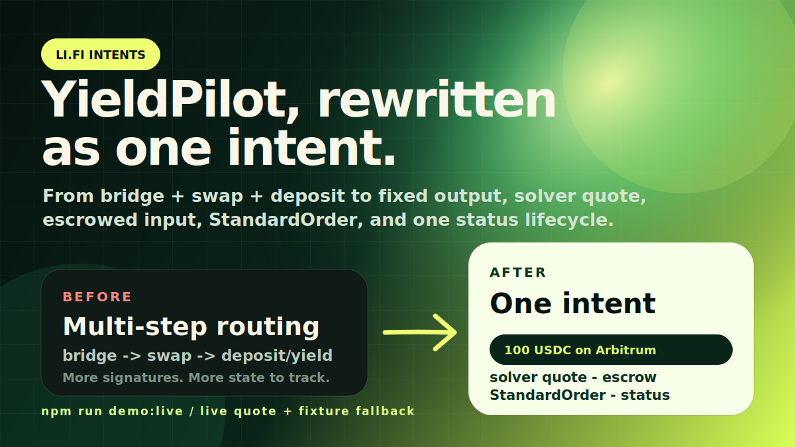
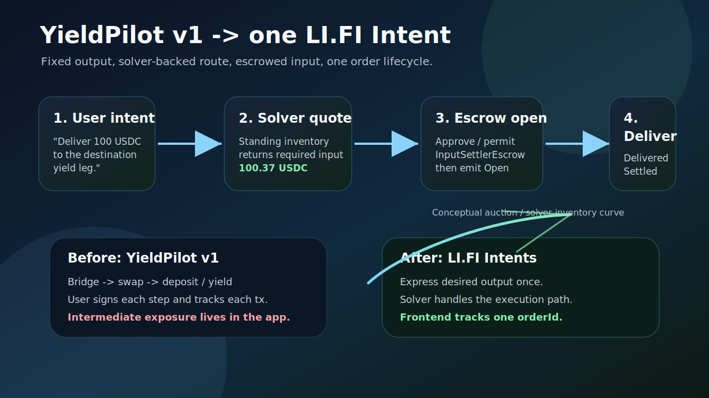

# LI.FI Intents: YieldPilot Playbook

A before/after playbook showing how YieldPilot's multi-step cross-chain yield move collapses into one solver-backed LI.FI Intent.



YieldPilot v1, built at the last LI.FI hackathon, orchestrated a stablecoin yield move as separate route steps: scan balances, rank vaults, quote execution, then track the move. This playbook keeps the same user problem but changes the execution model: the user expresses the desired destination outcome, a solver quote prices the required input, escrow holds the payment, and the frontend follows one order lifecycle.

## Why This Exists

Most intent explainers stop at "bridging but easier." That misses the builder question: what intent shape creates useful solver inventory?

For a yield app, the important constraint is often the destination result, not the bridge path. A user does not care which bridge, DEX, or intermediate route is used. They care that a fixed amount arrives where their mandate wants it. LI.FI Intents let the app express that outcome directly.

## What Changed From YieldPilot v1

| YieldPilot v1 | With LI.FI Intents |
|---|---|
| Bridge, swap, then deposit/yield as sequential cross-chain calls | Express desired output; solver handles execution path |
| User signs each step and holds intermediate exposure | User signs once; escrow holds payment until delivery |
| Frontend tracks bridge, swap, and status separately | Frontend tracks one orderId from the `Open` event |
| Route quality is mostly a frontend ranking problem | Intent quality depends on matching useful solver standing quotes |
| Failure handling is app-specific | Quote metadata can describe refund/failure handling |

## Intent Lifecycle



The demo scenario is intentionally narrow:

1. User wants a fixed destination output for a stablecoin yield move.
2. LI.FI's order server prices the request against solver standing quotes.
3. User approves or permits `InputSettlerEscrow` for the required input amount.
4. A `StandardOrder` is opened on the payment chain.
5. Solver delivers the destination output.
6. The frontend tracks `Delivered` and `Settled` through order status or on-chain events.

This uses the simple escrow path because it is the clearest migration path for a YieldPilot-style app. Compact/resource-lock flows are powerful, but not required to explain the v1 to intents upgrade.

## Running The Demo

```bash
npm install
npm run demo
```

Expected marker:

```text
LIFI_INTENTS_YIELDPILOT_PLAYBOOK_READY
```

The default command uses a fixture so the artifact is stable during the 24-hour challenge window.

To try the live quote path:

```bash
npm run demo:live
```

`demo:live` calls `https://order.li.fi/quote/request` by default. Override with:

```bash
LIFI_INTENTS_QUOTE_URL="https://order.li.fi/quote/request" npm run demo:live
```

If the live endpoint rejects the route or the launch-day API changes, the script falls back to the fixture and prints the same output shape. That keeps the deliverable reproducible while still showing exactly where the live quote belongs.

Implementation note: LI.FI Intents use ERC-7930 interoperable addresses for `user`, `asset`, and `receiver` fields. The quote endpoint accepted the live request only after the asset bytes were lower-cased, so the fixture keeps the Base and Arbitrum USDC asset values lower-case.

## What The Script Prints

- input chain and token
- destination chain and fixed output token
- solver quote and required input amount
- `InputSettlerEscrow` address
- `StandardOrder` fields
- status lookup instructions using the order id from the `Open` event

The script does not spend funds or submit an order. It is a builder playbook and quote-shape demo. Adding wallet approval and `open(bytes)` is the next implementation step.

## What Is Live vs Simulated

| Surface | Status |
|---|---|
| YieldPilot source project | Live reference app from prior LI.FI hackathon |
| Intent lifecycle | Based on LI.FI Intents docs |
| Quote script default | Stable fixture |
| Quote script live mode | Calls LI.FI quote endpoint and falls back safely |
| Order submission | Not submitted by this bundle |
| Solver implementation | Out of scope |

## Why This Matters For Solvers

Yield apps create repeated, predictable demand: stablecoin in, fixed destination outcome out. That is good inventory for standing quotes because the app can standardize common routes and amounts instead of asking the solver network to interpret arbitrary user journeys.

The product lesson from YieldPilot v1 is simple: the user mandate should stay human-readable, but execution should become outcome-based. LI.FI Intents are the cleaner execution layer for that.

## Sources

- LI.FI Intents overview: https://docs.li.fi/lifi-intents/introduction
- Request a quote: https://docs.li.fi/lifi-intents/intents-api/request-quote
- Create and submit orders: https://docs.li.fi/lifi-intents/intents-api/create-and-submit
- Track order status: https://docs.li.fi/lifi-intents/intents-api/track-status
- Settlement architecture: https://docs.li.fi/lifi-intents/architecture/settlement
